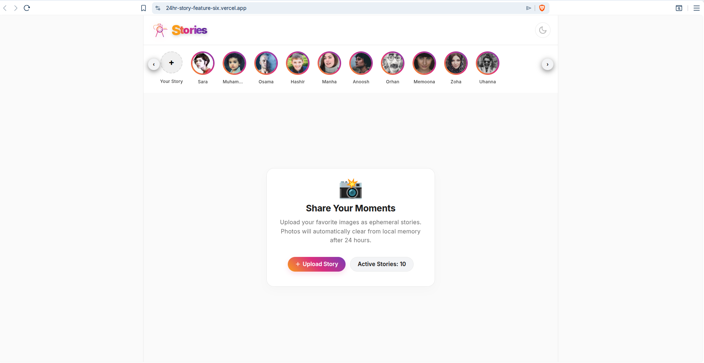
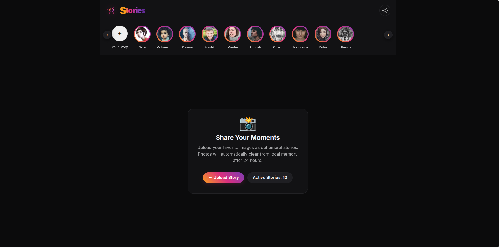
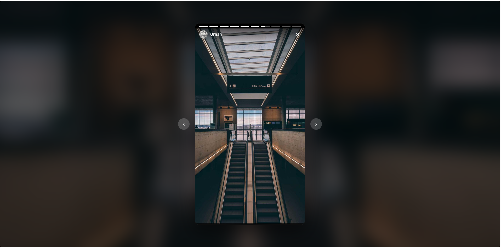

# 📱 24-Hour Stories Feature

A modern, responsive, and accessible **Instagram-style Stories** feature built with **React**, **TypeScript**, **Vite**, and **CSS Modules**. The project supports story creation, interactive story viewing, light/dark themes, and a clean, modular architecture designed for scalability and maintainability.

## Live Demo

You can view the live project deployed on Vercel here:  
🔗 **[Launch Live Project](https://24hr-story-feature-six.vercel.app/)**

## Features

- View stories in a horizontal stories bar
- Create and upload new stories
- 24-hour story expiration
- Light & Dark mode support
- Fully responsive design
- Smooth UI animations and transitions
- Full-screen story viewer
- Accessible form controls and semantic HTML
- Fast performance with Vite

## Technical Highlights

### Component Architecture

The project follows a modular, component-based architecture. Each React component is paired with its own CSS Module, keeping styles isolated, maintainable, and free from global conflicts.

| Component            | Responsibility                                                                        |
| -------------------- | ------------------------------------------------------------------------------------- |
| **App**              | Root application component responsible for application layout and state management.   |
| **StoriesBar**       | Displays the horizontal list of user stories.                                         |
| **StoryItem**        | Renders an individual story thumbnail with user information and interaction handling. |
| **StoryModal**       | Displays the selected story in a full-screen modal with navigation controls.          |
| **StoryProgressBar** | Shows animated progress for the currently active story.                               |
| **CreateStoryModal** | Provides the interface for creating and uploading new stories.                        |
| **UserBadge**        | Displays user avatar, name, and story status consistently across the application.     |

### Project Structure

```text
src/
│
├── App.tsx
├── App.module.css
│
├── components/
│   ├── StoriesBar.tsx
│   ├── StoriesBar.module.css
│   │
│   ├── StoryItem.tsx
│   ├── StoryItem.module.css
│   │
│   ├── StoryModal.tsx
│   ├── StoryModal.module.css
│   │
│   ├── StoryProgressBar.tsx
│   ├── StoryProgressBar.module.css
│   │
│   ├── CreateStoryModal.tsx
│   ├── CreateStoryModal.module.css
│   │
│   ├── UserBadge.tsx
│   └── UserBadge.module.css
│
├── data/
│   └── defaultStories.tsx
│
├── types/
│   └── story.ts
│
├── index.tsx

```

### Styling

- CSS Modules for component-scoped styling
- Clean separation of layout and presentation
- Responsive design optimized for desktop and mobile devices
- Global styles managed through `index.css`

### Performance

- Optimized React hooks and dependency management
- Reduced unnecessary re-renders
- Efficient state management
- Lightweight component structure
- Fast development and production builds powered by Vite

### Accessibility

- Proper `label` and `htmlFor` associations
- Semantic HTML structure
- Improved screen reader compatibility

### Code Quality

- Type-safe React components using TypeScript
- Consistent project structure
- Modular and reusable codebase
- Cleaner SVG markup
- Component-scoped styling using CSS Modules

## Tech Stack

- React
- TypeScript
- Vite
- CSS Modules
- Git & GitHub
- Vercel

## Getting Started

Clone the repository:

```bash
git clone https://github.com/MunsifAhmadMir/24hr-story-feature.git
```

Navigate to the project:

```bash
cd 24hr-story-feature
```

Install dependencies:

```bash
npm install
```

Start the development server:

```bash
npm run dev
```

Open your browser and visit:

```text
http://localhost:5173
```

## Deployment

The project is deployed on **Vercel** with automatic deployments enabled.

Every push to the GitHub repository triggers a new production deployment, ensuring the live application always stays up to date.

## License

This project is available for educational and portfolio purposes.

## Screenshots

### Light Mode



### Dark Mode



### Story Viewer


